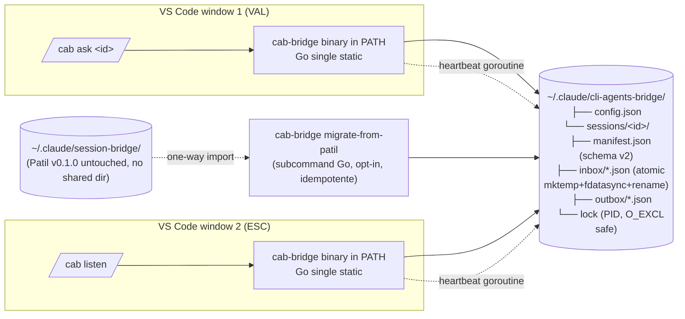

# PLAN.md v3 — Fork `cli-agents-bridge` (RATIFIED)

> **Iterazione 3** — VAL synthesis su input multipli convergenti.
> **Status**: RATIFIED, pronto per Sprint 0 implementation.
> **Genesi**:
> - PLAN v1 ESC (locale) → 7 FIX richiesti VAL → archived `iterations/PLAN_v1_ESC.md`
> - PLAN v2 ESC (locale, post-rework) → archived `iterations/PLAN_v2_ESC.md`
> - Ultraplan remoto (cloud Claude Code multi-agent) → 5 catch integrati
> - VAL critical review → 13 micro-fix chirurgici applicati
> - **v3 = synthesis canonica** per implementation
> - **Data**: 2026-05-24

---

## Context

Fork del plugin `PatilShreyas/claude-code-session-bridge` v0.1.0 (commit `8d0816b`, MIT, marzo 2026). NB: il tag `v0.1.1` citato nei briefing iniziali **non esiste come tag upstream** — è label interna usata dai VAL precedenti (verificato github-hunter ESC v1).

Empiricamente: **6 bug critici + 3 bug aggiuntivi confermati** (vedi §2), **15+ frizioni UX** documentate da 3 VAL convergenti in `briefing/`.

**Cambio strategico v3 (vs v2 e v1)**:
- **Tech**: Go from day 1 (single binary, type safety, 10y compat Go 1 promise)
- **Backward compat**: namespace separato `~/.claude/cli-agents-bridge/`
- **Distrib**: self-marketplace GitHub **primary** + pure-PATH install **fallback** se plugin tree fallisce — **Day 0 spike OBBLIGATORIO** per validare empiricamente
- **Schema**: trimmed YAGNI (manifest 4 campi nuovi, message lean)
- **Security baseline esplicita in MVP** (5 SC P0 + 2 P1)
- **Metriche successo MVP misurabili** (6 metriche numeriche)
- **Effort onesto 5-7 giorni** (vs 4 v2, vs 3 v1 — ESC v2 ha ammesso optimismo, ultraplan ha confermato range senior realistic)

---

## 1. Executive summary

Rewrite del plugin in **Go single binary** distribuito via **self-marketplace GitHub** (primary) con **pure-PATH install fallback** (se Day 0 spike rileva blocker plugin tree). Risolve 9 bug confermati nel source upstream + introduce role routing, longest-prefix session lookup, atomic write con `fdatasync`, security baseline P0/P1 (umask 077, perms 700/600, ownership check, session-ID regex validation, lock file `O_EXCL` safe). Namespace storage separato (`~/.claude/cli-agents-bridge/sessions/`) elimina rischio cleanup cross-distruttivo con plugin Patil coesistente. Schema manifest v2 minimale (4 campi nuovi: `schemaVersion`, `role`, `agentName`, `pid`). MVP target **5-7 focus-days** (dev part-time + smoke test Alan ~45 min); 8 deliverable scope-chiuso + Day 0 spike FIX-4 OBBLIGATORIO; 9 regression test per bug critici + 5 scenario integration. Daemon Unix socket Go opt-in **gated** a v0.4 con due condizioni esplicite (latenza polling >200ms ∧ peer count >3). Marketplace ufficiale Anthropic submission deferred a v1.0 dopo 1-2 mesi uso reale.

---

## 2. Validazione bug upstream

[CONFERMATO da ESC v1+v2, ricapitolato sinteticamente. Repo: `PatilShreyas/claude-code-session-bridge` @ commit `8d0816b`, tag `v0.1.0` unico.]

| ID | Severità | Verdict | File:linee |
|---|---|---|---|
| BUG-1 Heartbeat dead in listen loop | 🔴 CRITICAL | CONFIRMED | `bridge-listen.sh:30-68` |
| BUG-2 `bridge-receive.sh` timeout secco | 🔴 CRITICAL | CONFIRMED | `bridge-receive.sh:15-43` |
| BUG-3 Multi-peer routing senza role | 🔴 CRITICAL | CONFIRMED | `register.sh:35-49` |
| BUG-4 `cleanup.sh` globale cross-project | 🔴 CRITICAL | CONFIRMED | `cleanup.sh:55-67` |
| BUG-5 `get-session-id.sh` parent fallback | 🔴 CRITICAL | CONFIRMED | `get-session-id.sh:25-36` |
| BUG-6 Session ID collision per cwd | 🟠 MEDIUM | CONFIRMED | `register.sh:10-24` |
| **BUG-7** `bridge-receive.sh` error su **stdout** invece di stderr | 🟡 HIGH | CONFIRMED | `bridge-receive.sh:41` |
| **BUG-8** STALE_SECONDS inconsistente: list-peers 300s vs cleanup 1800s | 🟡 HIGH | CONFIRMED | `list-peers.sh` + `cleanup.sh` |
| **BUG-9** `connect-peer.sh` non aggiorna heartbeat sender | 🟡 HIGH | CONFIRMED | `connect-peer.sh` |

### 2.1 Pattern strutturale (root cause sotto i 9 bug)

Nessuno script del loop operativo (listen, receive, connect) aggiorna heartbeat. L'architettura presuppone heartbeat scheduling esterno, ma **nessun comando `/bridge` lo schedula**. È un design gap fondamentale: la fix richiede astrazione di lifecycle (lifecycle manager) non patch puntuali.

In Go: heartbeat diventa metodo del session manager invocato da goroutine dedicata con `time.Ticker`. Atomic update via `fdatasync` + `rename`. Risolto strutturalmente, non patchato.

---

## 3. Decisioni architetturali

### 3.1 Strategia tecnologica → **C (Go rewrite per MVP) + E gated (Go daemon opzionale v0.4)**

Confronto 5 opzioni con scoring deep-searcher (peso: Sicurezza 20% / Portabilità 20% / Manutenibilità 3y 25% / IPC idiomatico 15% / Effort MVP 20%):

| Opzione | Score | Verdict |
|---|---|---|
| A: bash+jq drop-in | 4.8 | ❌ Tech debt strutturale, jq non-POSIX, no type safety, bash deprecated su macOS |
| B: Python rewrite | 6.2 | ❌ Runtime dependency, stdlib stabile ma Python 3.x minor break asyncio possibile |
| **C: Go rewrite** | **8.2** | ✅ **Scelto** — single static binary, Go 1 compat ≥10y, type safety, goroutines per polling |
| D: Rust rewrite | 6.4 | ❌ Setup rustup non installato, learning curve Alan non-Rust, async/Pin/Box ostile a freddo |
| E: Ibrido (bash thin + daemon) | 5.8 | 🟡 Doppio codebase = 2x test surface. Pattern valido come **evoluzione v0.4** non MVP |

**Motivazione scelta C (Go)**:
1. **Risolve strutturalmente i 9 bug**, non superficialmente. Pattern bash atomic-rewrite + status check + heartbeat goroutine sono nativi in Go, contorti in bash.
2. **Go 1.26.0 darwin/arm64 già installato** via Homebrew (verificato). Zero setup overhead.
3. **Cross-compile zero-friction**: `GOOS=linux CGO_ENABLED=0 go build` → static binary deployabile su macOS+Linux senza Python/jq runtime deps.
4. **Manutenibilità 3 anni**: Go compatibility promise (mai violata da 2012). Future Alan riapre codice e compila. Bash invece: macOS ha già spostato default a zsh, jq syntax non intuitiva a freddo.
5. **Plugin Claude Code marketplace**: schema 2026 supporta `bin/` directory che viene auto-added al `PATH`. Binary Go in `bin/cab-bridge` è pattern integration idiomatico — wrapper bash entry-point (opzionale) eliminabile usando direttamente il binary.

**Trade-off Go onesti**:
- **Verbosità err handling**: `if err != nil {...}` ricorrente. Per ~800 LOC totali tollerabile.
- **Effort MVP +2 giorni vs bash patch**: 5-7 giorni vs 3 di bash. Onesto: scrivere Go test idiomatic + cross-compile CI costa tempo iniziale. Ammortizzato già al v0.3.
- **Socket path 108-char limit su macOS**: il path `~/.claude/cli-agents-bridge/sessions/<id>/bridge.sock` può eccedere. **Mitigation v0.4**: socket in `/tmp/cab-$UID/cab-<short-id>.sock`, parent dir creata con perms 700 + ownership check pre-bind. Dati restano in `~/.claude/cli-agents-bridge/`.
- **Goroutine leak su crash**: process lifecycle deve usare `context.Context` con cancellation per evitare leak. Pattern standard, da rispettare con disciplina.
- **Cross-compile flock/file locks**: usare `golang.org/x/sys/unix` per syscall portable (no cgo). Evita break Darwin-specific su Linux build.

**Daemon v0.4 in Go (stessa stack, gated)**: due gate-condition esplicite per attivare daemon:
- **G1**: latenza filesystem polling misurata >200ms in sessioni reali long-run
- **G2**: peer count concorrente >3 in scenario reale

Se G1 ∧ G2 non si verificano in 2 settimane post-MVP, daemon **non si fa**. Pattern auto-start daemon detached al primo uso (self-contained, no marketing buzzwords): bash client probe `/tmp/cab-$UID/cab.sock` → se assente fork daemon con `os/exec` `Process.Release()` → daemon resta detached. Fallback graceful a filesystem mode se daemon non started.

**Tradeoff scartati v3**: B (Python runtime dep), D (Rust learning curve+rustup overhead), E in MVP (scope creep 2-codebase). A (bash drop-in) era la scelta v1 — refused dopo rework per ragioni di manutenibilità sopra.

### 3.2 Scope MVP v0.2.0 → **8 deliverable scope-chiuso + Day 0 spike**

Gli stessi 8 deliverable di v2 §3.2, ma con **Day 0 FIX-4 spike OBBLIGATORIO prima dei bug fix**:

**Day 0 (spike, ~3-4h)**:
- Verificare empiricamente shape distribuzione: self-marketplace GitHub funziona? Plugin tree custom path supporta Go binary? `${CLAUDE_PLUGIN_DATA}` env var disponibile a runtime?
- Test minimal: crea repo fresh, aggiunge via `/plugin marketplace add`, verifica binary call funziona, slash command renderizza
- **Output spike**: scelta deterministica self-marketplace vs pure-PATH fallback (vedi §3.5)
- **Bloccante**: senza esito spike NON si scrive codice bug fix (la repo structure dipende dalla scelta)

**Bug fix deliverable (Day 1-5)**:
1. **Fix BUG-1** Heartbeat goroutine in `cab listen` (Go `time.Ticker` + atomic manifest update)
2. **Fix BUG-2 + BUG-7** `cab receive` long-poll fino a `--max-deadline` (default 30 min) + errore su stderr + exit code 124 timeout
3. **Fix BUG-3** Manifest schema v2 minimale: `schemaVersion`, `role`, `agentName`, `pid` (vedi §4.3 trimmed)
4. **Fix BUG-4** `cab cleanup` default scope=my-session, --scope=global opt-in con confirm prompt
5. **Fix BUG-5** `cab register` longest-prefix-match con tracking `BEST_MATCH_LEN`
6. **Fix BUG-6** Lock file PID safe (`O_EXCL` semantics + `kill -0` check + stale recovery) + `--force-new` flag
7. **Enabling**: config loader centralizzato (`~/.claude/cli-agents-bridge/config.json` + env override) — risolve BUG-8 + elimina hardcoded
8. **Enabling**: `cab send --file <path>` flag (FRIC-2) + JSON schema validation pre-write (via `encoding/json` strict mode `DisallowUnknownFields`)

**OUT of scope MVP** (deferred v0.3+): daemon Unix socket, SQLite WAL, notification osascript/notify-send, conversation thread view, transcript persistente, dashboard, retry built-in, encryption, multi-machine, TUI, listen background mode.

### 3.3 Naming → **`cli-agents-bridge`** (RISOLTO, confermato)

Decisione chiusa pre-rework. Non si rimette in discussione. Motivazione completa in `memory/decisioni_architetturali_aperte.md`.

### 3.4 Backward compatibility → **Namespace separato `~/.claude/cli-agents-bridge/`** [FIX-3]

**Scelta hard**: namespace separato. Nessuna coesistenza filesystem con plugin Patil.

**Motivazione**:
- **Safety primaria**: `cleanup.sh` di Patil ha BUG-4 non fixato. Se condividessimo `~/.claude/session-bridge/sessions/`, una sessione `cli-agents-bridge` stale >30min verrebbe **silently distrutta** da qualunque `/bridge stop` di Patil running in altro VS Code. Inaccettabile.
- **Self-contained semantica**: il fork è prodotto distinto, non patch upstream. Namespace dedicato comunica chiaramente la separazione.
- **Migration esplicita**: `cab-bridge migrate-from-patil` (**subcommand Go del binary, NON wrapper bash**) copia manifest+inbox/outbox da `~/.claude/session-bridge/` a `~/.claude/cli-agents-bridge/` con schema v2 upgrade. Idempotente, dry-run support, backup pre-migration in `~/.claude/cli-agents-bridge/migration-backup-<date>/`.
- **Coesistenza slash command**: durante dev cab usa `/cab` (default, no collision con Patil installato). Al release v0.2.0, slash command resta `/cab` permanentemente — nessun install prompt "keep both vs replace" (era over-engineering v2). User che vuole `/bridge` aliasing può creare proprio command in `~/.claude/commands/bridge.md` linkando al binary cab.

**Path canonical v0.2.0**:
- Sessions: `~/.claude/cli-agents-bridge/sessions/<id>/`
- Config: `~/.claude/cli-agents-bridge/config.json`
- Archive: `~/.claude/cli-agents-bridge/archive/<YYYY-MM-DD>/<id>/`
- Lock: `~/.claude/cli-agents-bridge/sessions/<id>/lock` (PID file)

**Tradeoff scartati**:
- **A: force uninstall Patil come prereq install**: ostile a A/B testing, aumenta friction.
- **Shared dir con flag opt-out**: complica codice + non risolve race (Patil non sa del nostro flag).

### 3.5 Distribuzione → **Self-marketplace GitHub primary + pure-PATH install fallback** [FIX-4]

**Scelta**: distribuzione duale con **Day 0 spike** che determina la primary path empiricamente.

**Primary path (preferito)**: self-marketplace GitHub.
- Repo contiene `.claude-plugin/marketplace.json` che pubblica se stesso
- Utenti: `/plugin marketplace add <org>/cli-agents-bridge` + `/plugin install cli-agents-bridge@cli-agents-bridge`
- Integration ecosystem: `/plugin update`, version management, `/reload-plugins`
- Binary `bin/cab-bridge` auto-added al PATH dal plugin system (DA VERIFICARE Day 0 spike)
- `${CLAUDE_PLUGIN_DATA}` per state persistente (DA VERIFICARE Day 0 spike)

**Fallback path (se Day 0 spike fallisce)**: pure-PATH install.
- GitHub Release con binary pre-compilati cross-OS (darwin-arm64, darwin-amd64, linux-arm64, linux-amd64)
- Install via `curl -L <url> -o ~/.local/bin/cab-bridge && chmod +x`
- Slash commands minimal markdown in `~/.claude/commands/cab*.md` (invocano binary in PATH)
- Brew formula in tap dedicato deferred dopo v0.2.0

**Day 0 spike protocol**:
- Crea repo test fresh con `.claude-plugin/plugin.json` minimal + binary placeholder
- Tenta install via `/plugin marketplace add`
- Verifica: binary in PATH? `${CLAUDE_PLUGIN_DATA}` env var disponibile? Slash command si registra? Edit live in dev mode funziona?
- **Esito A (tutto OK)** → primary path attivo, fallback documentato come backup
- **Esito B (blocker)** → fallback diventa primary, marketplace deferred a quando blocker risolto upstream
- **Time-box**: max 4h spike. Se irrisolvibile in 4h → fallback automatico.

**Motivazione duale**:
- ESC v2 ha promosso "self-marketplace verified" basandosi su github-hunter, ma il check era doc-based non runtime-tested. **Verifica empirica obbligatoria** per evitare secondo "mea culpa" (come fu con auto-classifier v1).
- Fallback non è scope-creep: è risk mitigation. Codice scritto in modo che entrambe le distribution path siano supportate dal binary stesso (binary funziona sia se chiamato da plugin manager sia se in $PATH manuale).

**Dev workflow ESC durante MVP**:
```bash
claude --plugin-dir ~/develop/cli-agents-bridge  # edit liberi
/reload-plugins                                  # ricarica senza restart
```

**Marketplace Anthropic ufficiale**: deferred a v1.0 (dopo 1-2 mesi di uso reale, API stable).

**Tradeoff scartati**:
- **Standalone repo + curl-bash install.sh primary**: bypassa ecosystem plugin (no `/plugin update`, no version management). Solo come fallback.
- **Submission marketplace ufficiale Anthropic in MVP**: maintenance commitment + breaking change probabili in v0.3 = early rejection.

---

## 4. Architettura proposta

### 4.1 Diagramma high-level



Transport: filesystem polling JSON (MVP). Daemon Unix socket: assente in MVP, opzionale v0.4 gated.

### 4.2 Repo structure

**AGGIORNATO post-Sprint 0 (Day 0 spike finding)**: layout Patil-style mandatory per marketplace install Claude Code 2.1.150. Refactor applicato Sprint 1 day 1 (~1-2h pre bug fix). Source `.` non supportato — plugin tree va in subdir dedicata.

```
cli-agents-bridge/                       ← Go module root (top-level)
├── README.md                          # Quickstart + features + diff vs Patil
├── CHANGELOG.md                       # v0.2.0 → v1.0
├── LICENSE                            # MIT (compat upstream)
├── ARCHITECTURE.md                    # Design records (this PLAN.md merged post-release)
├── PRIVACY.md                         # GDPR data flow doc (§9.6)
├── SECURITY.md                        # Threat model + reporting (§9)
├── go.mod / go.sum                    # Go module (path: github.com/myAIPlugins/cli-agents-bridge)
├── Makefile                           # build/test/cross-compile/install/install-plugin
├── .claude-plugin/
│   └── marketplace.json               # source: "./plugins/cli-agents-bridge" (Patil-style)
├── plugins/                           # Plugin tree (mandatory subdir layout)
│   └── cli-agents-bridge/
│       ├── .claude-plugin/
│       │   └── plugin.json            # Manifest (schema 2026)
│       ├── commands/                  # Slash command markdown
│       │   ├── cab.md
│       │   ├── cab-listen.md
│       │   ├── cab-ask.md
│       │   ├── cab-peers.md
│       │   ├── cab-stop.md
│       │   └── cab-status.md
│       └── bin/
│           └── cab-bridge             # Binary distribuibile (copy da bin/ via Makefile target)
├── .github/workflows/
│   ├── ci.yml                         # go vet + test -race + cross-compile
│   └── release.yml                    # GoReleaser su tag push
├── cmd/
│   └── cab-bridge/
│       └── main.go                    # Entry-point CLI multiplexer
├── internal/
│   ├── config/                        # Config loader + defaults
│   ├── session/                       # Manager: register/lookup/lock
│   ├── transport/                     # Filesystem polling + atomic write
│   ├── message/                       # Schema v2 marshal/validate
│   ├── routing/                       # Role-based routing rules
│   ├── security/                      # umask, perms, ownership check, regex validation
│   └── cleanup/                       # Scope-aware cleanup + archive
├── bin/                               # Build output (cross-compile artifacts, .gitignore-d)
├── config/
│   └── default.json                   # Config template
├── schemas/
│   ├── manifest-v2.schema.json        # JSON Schema (reference + test fixture)
│   └── message-v2.schema.json
├── tests/
│   ├── unit/                          # *_test.go per ogni package internal/
│   ├── regression/                    # 9 test repro BUG-1..BUG-9
│   ├── integration/                   # Multi-process via subprocess
│   └── smoke-test.md                  # Checklist manuale Alan
└── docs/
    ├── spike-fix4-distribution.md     # Sprint 0 finding (immutable post-spike)
    ├── migration-from-patil.md
    ├── multi-esc-patterns.md          # Role routing esempi
    ├── security-model.md              # Threat model dettagliato
    ├── dev-conventions.md             # Go style, test pattern, commit conventions
    └── troubleshooting.md
```

**NB**:
- Nessun `scripts/migrate-from-patil.sh` bash wrapper. La migration è subcommand Go del binary (`cab-bridge migrate-from-patil`). Riduce surface code, evita doppio path.
- Layout pre-Sprint-0 aveva `.claude-plugin/plugin.json` + `commands/` + `bin/` a root del repo. **Non funzionante** per `/plugin marketplace add` (Claude Code 2.1.150 errore: "source type not supported"). Sprint 1 day 1 refactor sposta plugin tree in `plugins/cli-agents-bridge/` subdir. Vedi `docs/spike-fix4-distribution.md` §4.1-4.2.
- Makefile target `install-plugin`: copia `bin/cab-bridge` (build output cross-compile) → `plugins/cli-agents-bridge/bin/cab-bridge` (artifact distribuibile). Cp invece di symlink per evitare path resolution issue durante cache install Claude Code.

### 4.3 Schema manifest v2 (trimmed YAGNI) [FIX-2]

```json
{
  "sessionId": "abc123",
  "schemaVersion": 2,
  "projectName": "cli-agents-bridge",
  "projectPath": "/Users/alan/develop/cli-agents-bridge",
  "agentName": "VAL-main",
  "role": "val",
  "pid": 12345,
  "startedAt": "2026-05-24T18:00:00Z",
  "lastHeartbeat": "2026-05-24T18:01:00Z",
  "status": "active",
  "capabilities": ["query", "context-dump", "conversation"]
}
```

**Campi nuovi v2 minimali**: `schemaVersion`, `agentName`, `role`, `pid`. Solo questi 4.

**Rimossi vs v1 (YAGNI esplicito)**:
- `teamId`: nessuna feature MVP lo usa. Riconfermare in v0.3 se entrano feature team-routing (broadcast, fan-out).
- `supportedRoles`: ridondante con `role` (singolo valore).
- `allowedSenderRoles`: ACL non implementata in MVP (vedi §9 P2). `["*"]` default = dead code.

**Backward compat read**: schema v1 letto con defaults safe (`role="neutral"`, `agentName=projectName`, `pid=0`).

### 4.4 Schema message v2 (trimmed) [FIX-2]

```json
{
  "id": "msg-abc123",
  "schemaVersion": 2,
  "from": "session-id-1",
  "fromRole": "val",
  "fromAgentName": "VAL-main",
  "to": "session-id-2",
  "toRole": "esc",
  "type": "query",
  "timestamp": "2026-05-24T18:00:00Z",
  "status": "pending",
  "content": "<payload>",
  "inReplyTo": null,
  "metadata": {
    "fromProject": "cli-agents-bridge",
    "processingState": "pending"
  }
}
```

**Rimosso vs v1**: `threadId`. Nessuna view threading in MVP → dead field. Riconfermare in v0.3 quando entra `cab thread <id>` view.

### 4.5 Componenti core + responsabilità

| Package Go (`internal/`) | Responsabilità | Risolve |
|---|---|---|
| `config` | Load `config/default.json` + override `~/.claude/cli-agents-bridge/config.json` + env vars | BUG-8, hardcoded |
| `session/manager` | Register + longest-prefix lookup + heartbeat goroutine | BUG-1, BUG-5, BUG-9 |
| `session/lock` | PID lock `O_EXCL` + stale recovery (`kill -0`) + `--force-new` flag | BUG-6 |
| `transport/fs` | Atomic write (mktemp same-dir + `fdatasync` + rename via `golang.org/x/sys/unix`), polling con `time.Ticker` | BUG-2, atomic write FIX-7 |
| `message/schema` | Marshal/Unmarshal v2, strict validation via `encoding/json` `DisallowUnknownFields` + regex constraints | FRIC-7, BUG-3 |
| `routing` | Role-based compat check pre-send (default: val↔esc, `--allow-mesh` per esc↔esc) | BUG-3 |
| `security/perms` | umask 077 syscall, chmod 700/600 enforce, ownership check, session ID regex validation | §9 SC-1..SC-5 |
| `cleanup` | Scope-aware: my-session default, --scope=global con confirm, pre-delete inbox archive | BUG-4 |
| `cmd/cab-bridge` | CLI multiplexer (register/listen/ask/receive/peers/cleanup/status/migrate/inspect) | UX unificata |

### 4.6 Plugin manifest `.claude-plugin/plugin.json` (schema Claude Code 2026)

```json
{
  "name": "cli-agents-bridge",
  "displayName": "CLI Agents Bridge",
  "version": "0.2.0",
  "description": "Robust multi-peer IPC bridge between CLI agent sessions (Claude Code, etc.)",
  "author": {
    "name": "Alan",
    "email": "advertalis@gmail.com",
    "url": "https://github.com/<TBD-org>/cli-agents-bridge"
  },
  "homepage": "https://github.com/<TBD-org>/cli-agents-bridge",
  "repository": "https://github.com/<TBD-org>/cli-agents-bridge",
  "license": "MIT",
  "keywords": ["ipc", "multi-session", "bridge", "val-esc", "multi-agent"],
  "commands": ["./commands/"]
}
```

**Note (aggiornate post-Sprint 0 Day 0 spike)**:
- `dependencies` field non incluso (schema 2026 funzionante senza in Claude Code 2.1.150)
- `bin/cab-bridge` auto-added a PATH dal plugin system ✅ **VERIFICATO** marketplace mode (argv stringa nuda = PATH lookup riuscito, cache path `~/.claude/plugins/cache/<marketplace>/<plugin>/<version>/bin/`)
- `${CLAUDE_PLUGIN_DATA}` runtime env var **NON disponibile** ❌ — hypothesis falsificata empiricamente (EMPTY in marketplace mode + dev mode 2.1.150). Zero impatto architetturale: §3.4 namespace separato è `$HOME`-derived, indipendente da env Claude Code.
- `${CLAUDE_PLUGIN_ROOT}` runtime env var **NON disponibile** ❌ — stesso esito, stesso non-impatto.
- **Layout mandatory**: source `.` non supportato. Marketplace.json deve referenziare subdir `./plugins/<name>/` (Patil-style). Vedi §4.2 e `docs/spike-fix4-distribution.md`.

Riferimento dettaglio empirico: `docs/spike-fix4-distribution.md` §3-4 (verificato Claude Code 2.1.150, 2026-05-24).

---

## 5. Roadmap milestone

### v0.2.0 MVP (target: **5-7 focus-days ESC** — honest senior estimate)

Scope chiuso §3.2 (8 deliverable + Day 0 spike). Acceptance criteria = 9 regression test + 5 scenario integration §7 + 6 metriche §10.

| Day | Deliverable | LOC stimati Go |
|---|---|---|
| **0** | **FIX-4 spike**: empirical verify self-marketplace path, `${CLAUDE_PLUGIN_DATA}`, binary in PATH, slash command registration. Time-box 4h. Esito determina §3.5 path. | (no prod LOC, spike test repo) |
| 1 | Repo setup + go.mod + Makefile + cross-compile CI (`golang.org/x/sys/unix` for portable syscalls) + `internal/config` + `internal/security/perms` + tests skeleton | ~150 |
| 2 | `internal/session/manager` (register, longest-prefix, heartbeat goroutine) + `internal/session/lock` (PID safe) → fix BUG-1, BUG-5, BUG-6 | ~180 |
| 3 | `internal/transport/fs` (atomic write `fdatasync`+rename, polling Ticker) → fix BUG-2, BUG-7 + atomic write FIX-7 | ~120 |
| 3 | `internal/message/schema` v2 trimmed + `internal/routing` role check → fix BUG-3 | ~100 |
| 4 | `internal/cleanup` scope-aware + archive → fix BUG-4 + connect heartbeat → BUG-9. Config unified → BUG-8 | ~100 |
| 5 | `cmd/cab-bridge` multiplexer + `commands/*.md` slash commands + `cab send --file` flag + `cab inspect --json` (per automation/CI parsing post jq removal) | ~150 |
| 6 | Regression tests (9 bug) + integration tests (5 scenario) + migration subcommand | ~200 test LOC |
| 7 | Smoke test manuale Alan (~45 min) + README + PRIVACY.md + SECURITY.md + buffer fix-on-fix | (no prod LOC) |

**Total**: ~800 LOC Go (cmd + internal) + ~400 LOC test Go + 6 commands markdown + docs.

**Buffer onesto**: i 7 giorni sono realistic per dev part-time + Alan supervised + smoke test reale. Se Day 0 spike rivela blocker (es: self-marketplace path broken), aggiungere 1 giorno per fallback implementation. Range 5-7 riflette incertezza onesta.

**Release criteria v0.2.0**:
- 9 regression test green su BUG-1..BUG-9
- 5 scenario integration green
- 6 metriche successo §10 misurabili at smoke test
- Cross-compile macOS arm64 + linux amd64/arm64 in CI
- Plugin install funzionante (verificato in repo fresh, primary o fallback path)
- Smoke test manuale Alan cross-VS-Code passed
- README + PRIVACY.md + SECURITY.md presenti

### v0.3.0 (target: 1-2 settimane post-MVP validation)

Scope DOPO 1-2 settimane uso reale. Candidate (prioritization da rivalutare):
- Notification on receive (osascript/notify-send via syscall, ~30 LOC Go)
- `cab transcript` log persistente (JSONL append-only)
- `cab thread <id>` conversation view + `threadId` reintrodotto nel message schema
- `cab status` dashboard text
- `cab send --retry N --backoff exp` con idempotency content-hash
- Listen background mode (Go goroutine + signal handling)
- Auto-gc orphan sessions in register
- `teamId` reintrodotto nel manifest se broadcast/fan-out richiesto
- Brew tap formula

### v0.4.0 — Daemon Unix socket Go opt-in (target: 1-2 settimane, **GATED**)

**Gate conditions** (ENTRAMBE da soddisfare per attivare):
- **G1**: latenza filesystem polling misurata >200ms in sessione reale long-run >1h
- **G2**: peer count concorrente >3 in scenario reale

Se G1 ∧ G2 NON si verificano in 2 settimane post-v0.3, daemon **non si fa**.

Se gate-pass: daemon Go con `net.Listen("unix", ...)` su `/tmp/cab-$UID/cab.sock` (bypass 108-char macOS limit + isolation per UID). Parent dir `/tmp/cab-$UID/` creata con perms 700 + ownership check pre-bind (anti-attack altro UID). Auto-start detached al primo uso, filesystem mode resta funzionante in fallback.

### v1.0.0 target (3-6 mesi post-v0.2)

- Marketplace submission Anthropic ufficiale
- Brew tap (homebrew-cli-agents-bridge)
- SQLite WAL message store (opt-in, retention queries)
- Encryption opt-in (libsodium o age-encrypt, motivare use case reale prima)
- Multi-machine via Tailscale ACL (motivare empirically prima)
- Observability metrics Prometheus-style
- Documentation completa + esempi triadici Architetto+VAL+ESC

---

## 6. Strategy backward compat → Migration esplicita da Patil v0.1.0 (no shared dir) [FIX-3]

### 6.1 Decisione hard: namespace separato

**Nessuna coesistenza filesystem.** `cli-agents-bridge` opera in `~/.claude/cli-agents-bridge/`. Plugin Patil opera in `~/.claude/session-bridge/`. Indipendenti.

**Motivazione**: cleanup.sh di Patil (BUG-4 upstream non fixato) distruggerebbe sessioni cli-agents-bridge stale >30min. Inaccettabile. Vedi §3.4.

### 6.2 Migration `cab-bridge migrate-from-patil` (subcommand Go)

**Subcommand del binary Go, NON wrapper bash separato** (ridotto surface code).

```
cab-bridge migrate-from-patil [--dry-run] [--include-archive]
```

Comportamento:
1. Backup `~/.claude/session-bridge/` → `~/.claude/cli-agents-bridge/migration-backup-<YYYY-MM-DD-HHMMSS>/`
2. Scansiona `~/.claude/session-bridge/sessions/*/manifest.json`
3. Per ogni manifest v1: trasforma in v2 con defaults (`role="neutral"`, `agentName=projectName`, `pid=0`, `schemaVersion=2`)
4. Copia inbox/outbox preservando `*.json` files
5. Scrive in `~/.claude/cli-agents-bridge/sessions/<id>/` con perms 600/700 enforced (SC-2/SC-5)
6. Idempotente (re-run skippa sessioni già migrate via marker `.migrated`)
7. NON tocca source Patil (utente decide se rimuovere manualmente dopo verify)

### 6.3 Coesistenza plugin runtime

I due plugin sono completamente isolati:
- File namespace separati
- Slash command separati: cab=`/cab`, Patil=`/bridge`
- Binary separati (cab-bridge in `bin/`, Patil usa bash scripts)
- Cleanup scope: ogni plugin opera solo sul proprio namespace

Utente può installare both, transition graduale, eventualmente uninstall Patil manualmente. Zero auto-uninstall third-party.

---

## 7. Testing strategy

### 7.1 Unit (Go `testing` standard + `go test -race`)

Per ogni package `internal/*`: 3-5 test case (happy + error + edge). `testify/assert` per ergonomia. `go test -race` per detection race condition in CI.

### 7.2 Regression — 9 test (uno per BUG)

| Test | Repro | Pass criteria |
|---|---|---|
| BUG-1 | Spawn `cab listen` 10 min idle | `lastHeartbeat` < 90s per tutta durata |
| BUG-2 | VAL send timeout=10s, ESC risponde a 30s | `cab receive --max-deadline=60` ritorna response (no perdita) |
| BUG-3 | 1 VAL + 2 ESC, ESC tenta send a peer role=esc | Send block con error "esc→esc forbidden (use --allow-mesh)" exit 2 |
| BUG-4 | Sessione X attiva (cab) + sessione Y stale 35min (cab altro project) | `cab cleanup` default lascia entrambi (scope my-session) |
| BUG-5 | `/p1/` + `/p1/sub/` registered, invoke da `/p1/sub/nested/` | `cab register` ritorna ID di `/p1/sub/` |
| BUG-6 | 2 istanze cab in stessa cwd, both fanno register | Seconda istanza fail con "session locked by PID X, use --force-new" exit 1 |
| BUG-7 | bridge-receive con timeout | Error message su stderr, exit 124 esplicito |
| BUG-8 | STALE_SECONDS modificato in config | list-peers + cleanup leggono stesso valore (no inconsistenza) |
| BUG-9 | connect-peer su sessione stale | Heartbeat aggiornato pre-connect |

### 7.3 Integration — 5 scenari multi-process

Spawn N processi `cab-bridge` (subprocess Go test) per simulare sessioni:
1. 1 VAL + 1 ESC round-trip 10 messaggi (baseline)
2. 1 VAL + 2 ESC role routing (BUG-3 enforcement)
3. Long-run 30min listen idle (heartbeat persistence)
4. Cleanup cross-project safety (3 progetti cab attivi simultaneamente)
5. Migration: source `~/.claude/session-bridge/` con 3 sessioni Patil v1 → run migrate-from-patil → verify in `~/.claude/cli-agents-bridge/`

### 7.4 Day 0 spike verification test (NUOVO)

Pre-Sprint 1: test minimal repo con `.claude-plugin/plugin.json` + binary placeholder Go (50 LOC). Tenta:
- `/plugin marketplace add` da repo locale
- Verifica binary in PATH (`which cab-bridge-test`)
- Verifica slash command registration
- Verifica `${CLAUDE_PLUGIN_DATA}` env var disponibile a runtime
- Verifica edit live in dev mode (`--plugin-dir`)

Esito → input determinante per §3.5 path scelto. **Test fallito** → fallback pure-PATH attivato + 1 giorno buffer aggiunto a roadmap.

### 7.5 Smoke test manuale finale (~45 min Alan)

Pre-release: 2 finestre VS Code reali, cab installato via path scelto post-spike, eseguire `tests/smoke-test.md` checklist:
- 5 step setup (install, register VAL, register ESC, list peers, connect)
- 5 step happy path (send brief, receive response, role check, cleanup own, status)
- 5 step edge case (timeout 35min listen, send con --file, cleanup --scope=global confirm, force-new collision, migrate from Patil dry-run)

### 7.6 CI cross-compile + lint

GitHub Actions:
- `go vet`, `go test -race ./...`, `staticcheck`
- Cross-compile macOS arm64 + linux amd64/arm64 (no cgo, `golang.org/x/sys` for syscalls)
- Upload binaries come release artifacts su tag push (GoReleaser)

---

## 8. Risk register

| Risk | Probability | Impact | Mitigation |
|---|---|---|---|
| **R1**: Day 0 spike rivela self-marketplace path non funziona o blocca Go binary in plugin tree | **Media** | **Alto** | **Fallback path documentato §3.5: pure-PATH install + slash command minimal in `~/.claude/commands/`. Codice scritto compatibile con entrambe le distribution path. 1 giorno buffer aggiunto se fallback attivato.** |
| **R2**: 5-7 giorni MVP slip a 8+ giorni (Go learning curve test idiomatic + spike unexpected) | Media | Medio | Scope chiuso §3.2. Tier 2/3 deferred fisicamente in roadmap. `docs/dev-conventions.md` Day 1. Day 0 spike time-box 4h hard. |
| **R3**: Cross-compile breaks su macOS arm64 syscall specific (flock) | Bassa | Medio | Uso `golang.org/x/sys/unix` portable (no cgo). CI matrix test entrambi darwin+linux pre-release. |
| **R4**: Schema v2 trimmed troppo aggressivo → reintrodurre `teamId`/`threadId` in v0.3 rompe interop v0.2 | Bassa | Medio | Schema additivo: aggiungere campi in v0.3 NON rompe v0.2 reader (`encoding/json` ignora unknown unless `DisallowUnknownFields` strict — usato solo per validation gateway, non runtime read). |
| **R5**: Goroutine leak su crash listen | Media | Medio | `context.Context` con cancellation propagato in tutto session lifecycle. `defer cancel()` standard. `go test -race` in CI. |
| **R6**: Migration from Patil corrompe inbox messages non letti | Bassa | Alto | Backup pre-migration obbligatorio (no skip flag). Dry-run default-on per smoke test. NON tocca source Patil. |
| **R7**: 1 VAL + N ESC pattern troppo niche, ROI fork insufficiente | Bassa | Medio | Empirical evidence 15+ sub-sprint cross-project → ROI già validato pre-fork. |
| **R8**: jq dependency rimossa → utenti con script bash custom che parsa manifest break | Bassa | Basso | `cab-bridge inspect <session-id> --json` come sostituto programmatic-friendly. Migration doc spiega rimpiazzo. |
| **R9**: Plugin marketplace install path cambiato in Claude Code 2026.x patch release | Bassa | Alto | Day 0 spike verifica schema attuale 2026.05. Monitor anthropics/claude-code release notes per breaking change. Fallback pure-PATH path-agnostic. |

---

## 9. Security baseline [FIX-5]

### 9.1 Threat model

**In-scope** (minacce reali single-user macOS/Linux):
- **TM-1** Malware locale **UID diverso** legge inbox/outbox (PII briefing, codice). [Corretto v3: SC-1/SC-3 proteggono da UID diverso, non da malware stesso UID.]
- **TM-2** Path traversal via session ID injection
- **TM-3** TOCTOU su lock/manifest in scenario multi-ESC concurrent → mappato a SC-5 (atomic write helper) + SC-6 (lock O_EXCL)
- **TM-4** Cleanup cross-session distruttivo (BUG-4 originale, risolto §3.4 namespace separation)
- **TM-5** Symlink attack su creation dir → mappato a SC-7 (base dir integrity check)
- **TM-6** Cross-session impersonation (manifest spoofing) → mappato a SC-3 (ownership check)

**Out-of-scope MVP** (motivati esplicitamente):
- Attaccante remoto (local-only, zero network surface)
- Malware **stesso UID** (Alan-equivalent privilege — limite intrinseco modello Unix single-user, non risolvibile senza sandboxing OS-level es. macOS sandbox-exec)
- Supply chain attack sul plugin (fuori scope baseline)
- Privilege escalation (single-user workflow, no root)
- Encryption end-to-end (single-user single-disk = theater vs FileVault disk-level già attivo)
- Multi-tenant shared machine (esplicitamente fuori scope design)

### 9.2 Security Controls — P0 obbligatori v0.2.0

**SC-1 umask 077 enforcement**
- Dove: `cmd/cab-bridge/main.go` `init()` chiamata `syscall.Umask(0o077)` PRIMA di qualsiasi file/dir creation
- Verifica: regression test crea file via cab-bridge, verifica `stat` ritorna 600
- Copertura threat: TM-1 (UID diverso)

**SC-2 mkdir permessi 700**
- Dove: `internal/session/manager.go` register → `os.MkdirAll(sessionDir, 0o700)` + esplicito `os.Chmod(sessionDir, 0o700)` se dir preesistente
- Esteso a `~/.claude/cli-agents-bridge/`, `sessions/`, `archive/`, `inbox/`, `outbox/`
- Copertura threat: TM-1, TM-5

**SC-3 Ownership check pre-read/write file altrui**
- Dove: `internal/security/perms.go` helper `CheckOwnership(path string) error`
- Verifica `os.Stat(path).Sys().(*syscall.Stat_t).Uid == os.Getuid()`
- Edge case root (`Getuid()==0`): log warning "running as root, ownership check skipped", non abort
- Edge case NFS: documentato come known limitation, no fix MVP
- Copertura threat: TM-1, TM-6

**SC-4 Session ID regex validation (path traversal prevention)**
- Dove: `internal/security/validate.go` `ValidateSessionID(id string) error`
- Regex strict: `^[a-z0-9]{6,32}$` (compatibile con random 6-char attuale + friendly naming futuro)
- Applicato a tutti i field che diventano path component: `sessionId`, `inReplyTo`, `from`, `to`
- Copertura threat: TM-2

**SC-5 File permessi 600 + atomic write same-filesystem**
- Garantito da SC-1 (umask) + `os.WriteFile(path, data, 0o600)` esplicito
- Atomic write helper (`internal/transport/fs/atomic.go`):
  - `os.CreateTemp(dir, ".tmp.*")` con `dir` = stesso dir del target (garantisce same-filesystem, NO `mv` cross-filesystem)
  - Write data
  - `f.Sync()` (fdatasync equivalente Go cross-platform)
  - `os.Rename()` atomic (verified `EXDEV` se cross-filesystem — explicit error con warning)
  - Documentato edge case macOS APFS: rename intra-volume sempre atomic. Cross-volume → EXDEV explicit fail
- Copertura threat: TM-3 (TOCTOU write race), FIX-7

### 9.3 Security Controls — P1 importanti v0.2.0

**SC-6 Lock file PID safe (no symlink attack, no TOCTOU)**
- Pattern: `os.OpenFile(lockPath, O_CREATE|O_EXCL|O_WRONLY, 0o600)` — atomic creation, fail se esiste
- Stale recovery: read PID, `syscall.Kill(pid, 0)`, se errore `ESRCH` lock stale → rimuovi + retry una volta
- Cleanup: `defer os.Remove(lockPath)` + signal handler (SIGTERM/SIGINT)
- Copertura threat: TM-3 (TOCTOU lock), TM-5 (symlink protected by SC-2 perms 700 su parent)

**SC-7 Base dir integrity check at boot**
- All'avvio cab-bridge: `os.Lstat(baseDir)` → check non è symlink, perms 700, owner = `Getuid()`
- Se symlink: error "security: base dir is symlink, possible attack, aborting" exit 1
- Se perms diversi: warn + auto-chmod 700
- Copertura threat: TM-5

### 9.4 Security Controls — P2 deferred v0.3+ (motivato esplicito)

**SC-8 PII detection NON IMPLEMENTATA in MVP**
- Motivazione corretta v3: **NON è "theater"**, è "out-of-scope security baseline MVP". Indirizzato via §9.6 GDPR-4 (transcript opt-in default OFF) e via warning runtime all'avvio listen ("messages stored plaintext locally, do not send secrets").
- Regex scanning content sarebbe false-positive-prone + performance overhead. PII detection accurata richiede LLM-level analysis = scope creep v1.0+.

### 9.5 Rischi aggiuntivi VAL non menzionati nei briefing (RC-* da subagent security audit)

- **RC-1**: JSON value usati come path → SC-4 applicato a tutti i field path-relevant
- **RC-2**: `mv` cross-filesystem non atomic → SC-5 mktemp stesso dir + EXDEV check esplicito
- **RC-3**: in `cab-bridge migrate-from-patil` subcommand, validation paths input dal manifest Patil v1 obbligatoria (potrebbero contenere `..` path traversal in `projectPath` field corrupted)

### 9.6 GDPR / EU compliance checklist (local-only data)

- **GDPR-1 Data minimization**: `BRIDGE_RETENTION_DAYS=7` default nel config. Subcommand `cab cleanup --retention=N` opt-in scheduled
- **GDPR-2 Right to erasure**: `cab purge --session <id>` rm -rf safeguarded (SC-4 validation prima)
- **GDPR-3 Data localization**: `PRIVACY.md` documenta esplicitamente "no data leaves the local machine"
- **GDPR-4 Logging minimale opt-in**: transcript persistente (v0.3 candidate) sarà opt-in default OFF
- **GDPR-5 Trattamento documentato**: `PRIVACY.md` + `SECURITY.md` (no DPA needed, basta trasparenza)

---

## 10. Metriche successo MVP [FIX-6]

**Definizione "v0.2.0 successful at 1 settimana post-release"** = soglie misurabili.

Periodo misurazione: **1 settimana di uso reale Alan post-release**, baseline = comportamento Patil pre-fork.

| ID | Metrica | Soglia successo | Misurazione |
|---|---|---|---|
| **M1** | Falsi positivi "stale" su sessione attiva | **0** in 7 giorni listen long-run | Daily check: `cab peers` non mostra "stale" su ESC in listen attivo |
| **M2** | Incident cleanup cross-project distruttivi | **0** in 7 giorni | Dopo ogni `cab cleanup`, contare sessioni vive in altri project (deve essere invariato) |
| **M3** | Response perse per timeout secco | **0** su 50+ messaggi long-run (>60s response) | Log integrato `cab-bridge --debug` traccia send+receive id, mismatch detected |
| **M4** | ESC→ESC routing accidentale (Alan-reported original) | **0** su 5+ sessione 1-VAL-2-ESC | Routing role check blocca; smoke test scenario 2 mandatory |
| **M5** | Latenza round-trip ping-pong media | **<5s** (baseline Patil ~8s) | `cab status --benchmark` esegue 10 ping, riporta p50/p99 |
| **M6** | Setup nuovi peer time (`cab listen` → "ready") | **<60s** | Smoke test cronometra: register + listen + peer visible in altra VS Code |

**Failure criteria** (≥1 metrica below soglia per 2 settimane = action required):
- M1 o M2 violate = hotfix mandatory entro 48h (security/correctness regressions)
- M3 violate = root cause analysis + patch entro 1 settimana
- M4 violate = blocking, rollback v0.2 a v0.1 fork
- M5 o M6 violate = backlog v0.3 priority (no hotfix)

---

## 11. Open questions per VAL/Alan (residual)

Decisioni con default ESC + conferma Alan prima di Sprint 0:

1. **Repo GitHub org**: account personale Alan (`advertalis`) o org dedicata (placeholder `<TBD-org>` nel manifest §4.6)? Default ESC: org dedicata se intent community-distribution, personal se private MVP.
2. **Slash command `/cab` permanente**: confermato `/cab` (no install prompt dual `/bridge`). Default chiuso v3.
3. **Migration backup retention**: `migration-backup-<date>/` resta indefinitamente o auto-purge dopo N giorni? Default ESC: manual purge (utente decide), no auto-delete data critici.
4. **Smoke test Alan-time**: confermo ~45 min disponibili per smoke test pre-release (giornata 7 MVP)?
5. **CI public**: GitHub Actions su org Alan → free tier sufficiente per Go cross-compile (verificato). Confermi setup workflow?
6. **Dev sandbox isolation**: durante development userò env `CAB_DATA_DIR=/tmp/cab-dev/` override per non toccare prod Patil di Alan?

Se nessuna risposta entro Sprint 0 start, ESC procede con default. Tutti reversibili.

---

## 12. Next step concreto — Sprint 0 PHASE 2 brief

Quando VAL ratifica PLAN.md v3, primo brief PHASE 2 a ESC:

> **PHASE 2 — Sprint 0: Day 0 spike + Go module baseline + security P0**
>
> Task: validare empiricamente distribution path (Day 0 spike) + setup baseline repo Go con security P0.
>
> **Step ordinati (sequence rigida)**:
> 1. `cd /Users/alan/develop/cli-agents-bridge`
> 2. **Day 0 FIX-4 spike** (time-box 4h):
>    - Repo test fresh `/tmp/cab-spike/` con `.claude-plugin/plugin.json` minimal + binary Go placeholder (50 LOC)
>    - Test `/plugin marketplace add` da repo locale
>    - Verifica: binary in PATH, slash command registration, `${CLAUDE_PLUGIN_DATA}` env var, edit live `--plugin-dir`
>    - **Documenta risultato in `docs/spike-fix4-distribution.md`**
>    - **Esito A (OK)**: §3.5 primary path = self-marketplace. Procedi step 3.
>    - **Esito B (blocker)**: §3.5 fallback = pure-PATH install. Notifica VAL + adjust roadmap +1 giorno.
> 3. Repo structure §4.2 (folders + README placeholder + LICENSE MIT + SECURITY.md + PRIVACY.md stub)
> 4. `go mod init github.com/<TBD-org>/cli-agents-bridge` (org confermare con VAL, default `advertalis`)
> 5. `cmd/cab-bridge/main.go` skeleton con `syscall.Umask(0o077)` in init (**SC-1 day-1**)
> 6. `internal/security/perms.go` con `CheckOwnership`, `ValidateSessionID` (regex `^[a-z0-9]{6,32}$`), `EnforceDirPerms` (**SC-3, SC-4 day-1**)
> 7. `internal/security/perms_test.go` con 3 test base (regex valid/invalid/path-traversal, ownership match/mismatch, umask propagation)
> 8. `internal/config/config.go` loader (`~/.claude/cli-agents-bridge/config.json` + env `CAB_*` override) + `config/default.json` template
> 9. `Makefile` con target: `build`, `test`, `test-race`, `cross-compile-all` (uso `golang.org/x/sys/unix`), `install-dev`, `lint`
> 10. `.claude-plugin/plugin.json` + `.claude-plugin/marketplace.json` (basato su esito spike step 2)
> 11. `.github/workflows/ci.yml` (go vet + test -race + cross-compile macOS arm64 + linux amd64/arm64, no cgo)
> 12. Commit unico: "Sprint 0: Day 0 spike + Go module baseline + security P0 (umask, perms, validate)"
>
> **Done criteria**:
> - `docs/spike-fix4-distribution.md` esiste con esito documentato
> - `make test-race` passa
> - `make build` produce `bin/cab-bridge` macOS arm64
> - `make cross-compile-all` produce linux amd64+arm64 binaries
> - `bin/cab-bridge --version` ritorna `0.2.0-dev`
> - File creati dal binary hanno perms 600 (verificato manualmente)
> - Plugin install funzionante (path scelto post-spike)
>
> Stima effort: 4h spike + 3-4h baseline setup = 1 giornata Sprint 0.

**Successivi PHASE 2 sprint**:
- **Sprint 1** (Day 2): BUG-1 + BUG-5 + BUG-6 (session manager + heartbeat goroutine + PID lock safe)
- **Sprint 2** (Day 3): BUG-2 + BUG-7 + atomic write helper (transport/fs + message schema v2)
- **Sprint 3** (Day 4): BUG-3 + BUG-4 + BUG-8 + BUG-9 (routing role + cleanup scoped + config unified + connect heartbeat)
- **Sprint 4** (Day 5-6): send --file + multiplexer cmd + slash commands + migration subcommand + `inspect --json` + tests
- **Sprint 5** (Day 7): Smoke test Alan + README + PRIVACY.md + SECURITY.md + release v0.2.0

---

## Note finali — VAL synthesis attribution

**Cambiamenti v3 vs v2** (synthesis):

Da **ultraplan cloud** integrati:
1. ✅ Effort onesto 5-7 giorni (vs 4 v2 optimistic)
2. ✅ FIX-4 Day 0 spike OBBLIGATORIO prima dei bug fix (disciplina senior)
3. ✅ R1 fallback pure-PATH install se plugin tree fail (backup plan elegante)
4. ✅ Cross-compile flock via `golang.org/x/sys/unix` (no cgo)
5. ✅ Mermaid diagram §4.1 (render GitHub)

Da **VAL critical review** (13 micro-fix):
1. ✅ §3.5 hypothesis self-marketplace "verified" → "verificare Day 0 spike" (no second mea culpa)
2. ✅ Slash command `/cab` permanente confermato (rimosso install prompt dual)
3. ✅ Effort range 5-7 giorni accettato come honest
4. ✅ Migration: subcommand Go ONLY, eliminato `scripts/migrate-from-patil.sh` bash wrapper (no duplicate path)
5. ✅ Pattern "CocoIndex auto-start" → descrizione self-contained (no marketing dependency)
6. ✅ TM-1 corretto: "malware UID DIVERSO" (no malware stesso UID, fuori scope)
7. ✅ TM-3 TOCTOU mapping esplicito a SC-5 + SC-6
8. ✅ SC-8 motivazione "theater" → "out-of-scope MVP, indirizzato via GDPR-4 opt-in"
9. ✅ Daemon v0.4 socket security: `/tmp/cab-$UID/` con perms 700 + ownership check pre-bind
10. ✅ R8 jq dep removal: `cab inspect --json` come sostituto programmatic
11. ✅ `monitors experimental` reference rimosso (era dead reference v2)
12. ✅ R9 aggiunta per plugin marketplace path change risk
13. ✅ Repo structure: rimosso `scripts/migrate-from-patil.sh`, aggiunto `docs/dev-conventions.md`

Da **ESC v2 base** preservato:
- Scoring quantitativo §3.1 (5 opzioni × 5 criteri pesati)
- §2.1 pattern strutturale heartbeat gap
- Tutto §9 security baseline (con accuracy fix)
- Tutto §10 metriche successo con failure criteria
- §3.4 namespace separation hard decision
- BUG-7/8/9 dettagliati con file:linee
- Repo structure dettagliata Go module
- Risk register esteso

**Commit traceability**: ogni catch ultraplan + ogni micro-fix VAL attribuito esplicitamente per audit.

**Status**: RATIFIED. Pronto per Sprint 0 implementation. Brief PHASE 2 §12 può partire.

— VALUTATORE (Alan + Opus 4.7)
